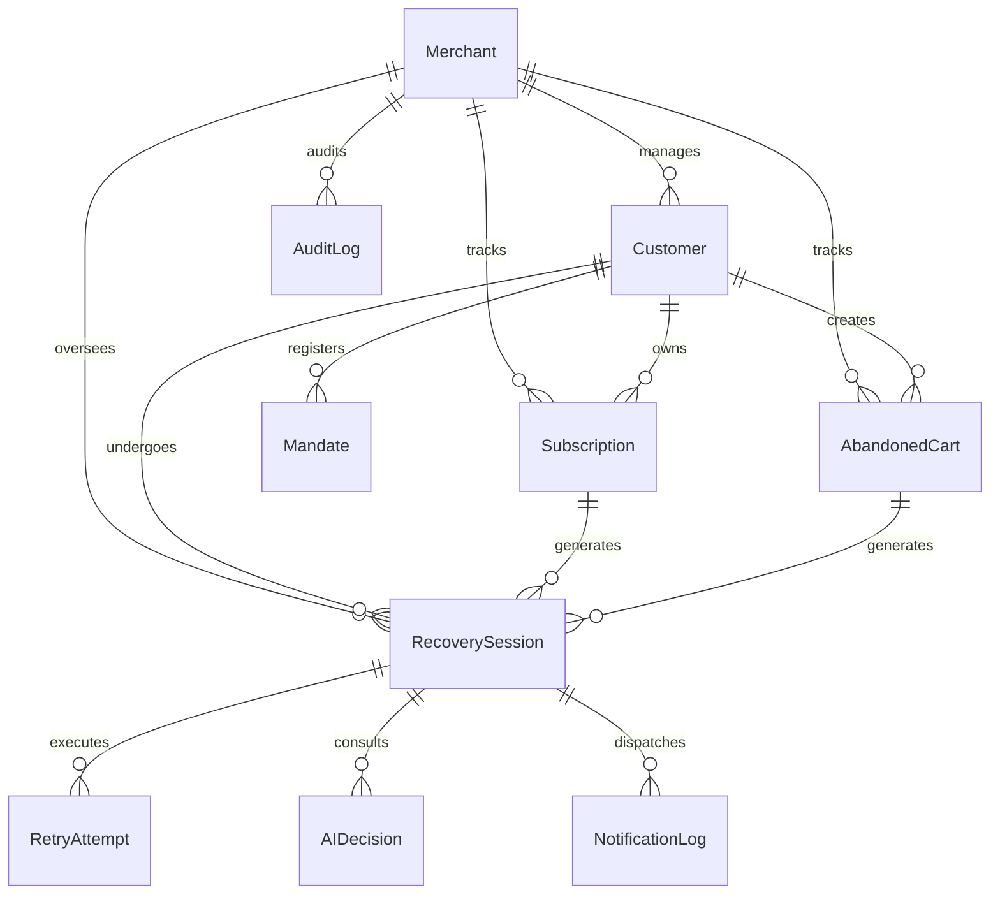

# Database Schema Specification (Prisma / PostgreSQL)

> **"Recover Revenue. Respect the Rules."**  
> Data model and relational schema for Vasooli.

---

## 1. Entity Relationship Overview



---

## 2. Prisma Schema Definition (`prisma/schema.prisma`)

```prisma
datasource db {
  provider = "sqlite" // Can be switched to postgresql seamlessly
  url      = env("DATABASE_URL")
}

generator client {
  provider = "prisma-client-js"
}

enum RecoveryType {
  SUBSCRIPTION_AUTOPAY
  CHECKOUT_ABANDONMENT
}

enum RecoveryStatus {
  ANALYZING_AI
  SCHEDULED_RETRY
  PAYMENT_LINK_SENT
  RETRY_IN_PROGRESS
  RECOVERED_AUTO_DEBIT
  RECOVERED_VIA_LINK
  STOP_NPCI_LIMIT_REACHED
  STOP_TERMINAL_FAILURE
  STOP_CUSTOMER_OPTED_OUT
  STOP_DISCOUNT_FLOOR_EXCEEDED
  STOP_MANUAL_CANCELLED
}

enum FailureCodeCategory {
  TRANSIENT_FUNDS      // U30, UT, U54, ZA
  ACTION_REQUIRED      // ZM, U68, U19
  HARD_STOP_TERMINAL   // ZG, U16, M4, U28, Z9
  CHECKOUT_INACTIVITY  // CART_DROP_OFF
}

enum NotificationChannel {
  WHATSAPP
  SMS
  EMAIL
}

enum NotificationStatus {
  QUEUED
  SENT
  DELIVERED
  READ
  LINK_CLICKED
  FAILED
}

model Merchant {
  id                String            @id @default(cuid())
  name              String
  email             String            @unique
  razorpayKeyId     String?
  razorpayKeySecret String?
  webhookSecret     String?
  maxDiscountPct    Float             @default(10.0)
  autoRecoveryEnabled Boolean         @default(true)
  createdAt         DateTime          @default(now())
  updatedAt         DateTime          @updatedAt

  customers         Customer[]
  subscriptions     Subscription[]
  abandonedCarts    AbandonedCart[]
  recoverySessions  RecoverySession[]
  auditLogs         AuditLog[]
}

model Customer {
  id                String            @id @default(cuid())
  merchantId        String
  merchant          Merchant          @relation(fields: [merchantId], references: [id], onDelete: Cascade)
  razorpayCustId    String?           @unique
  name              String
  email             String
  phone             String
  optedOut          Boolean           @default(false)
  lifetimeRecovered Float             @default(0.0)
  lifetimeLost      Float             @default(0.0)
  createdAt         DateTime          @default(now())
  updatedAt         DateTime          @updatedAt

  mandates          Mandate[]
  subscriptions     Subscription[]
  abandonedCarts    AbandonedCart[]
  recoverySessions  RecoverySession[]

  @@index([merchantId, email])
  @@index([merchantId, phone])
}

model Mandate {
  id                String            @id @default(cuid())
  customerId        String
  customer          Customer          @relation(fields: [customerId], references: [id], onDelete: Cascade)
  razorpayMandateId String            @unique
  vpa               String?
  bankName          String?
  maxAmount         Float
  frequency         String            @default("monthly")
  status            String            @default("active") // active, paused, revoked, expired
  createdAt         DateTime          @default(now())
  updatedAt         DateTime          @updatedAt

  subscriptions     Subscription[]
}

model Subscription {
  id                String            @id @default(cuid())
  merchantId        String
  merchant          Merchant          @relation(fields: [merchantId], references: [id], onDelete: Cascade)
  customerId        String
  customer          Customer          @relation(fields: [customerId], references: [id], onDelete: Cascade)
  mandateId         String?
  mandate           Mandate?          @relation(fields: [mandateId], references: [id])
  razorpaySubId     String            @unique
  planName          String
  amount            Float
  currency          String            @default("INR")
  billingCycle      String            @default("monthly")
  nextDueDate       DateTime
  status            String            // active, past_due, halted, cancelled, completed
  createdAt         DateTime          @default(now())
  updatedAt         DateTime          @updatedAt

  recoverySessions  RecoverySession[]
}

model AbandonedCart {
  id                String            @id @default(cuid())
  merchantId        String
  merchant          Merchant          @relation(fields: [merchantId], references: [id], onDelete: Cascade)
  customerId        String
  customer          Customer          @relation(fields: [customerId], references: [id], onDelete: Cascade)
  itemsSummary      String
  cartValue         Float
  currency          String            @default("INR")
  abandonedAt       DateTime          @default(now())
  checkoutUrl       String?
  status            String            @default("abandoned") // abandoned, recovered, expired
  createdAt         DateTime          @default(now())
  updatedAt         DateTime          @updatedAt

  recoverySessions  RecoverySession[]
}

model RecoverySession {
  id                String            @id @default(cuid())
  merchantId        String
  merchant          Merchant          @relation(fields: [merchantId], references: [id], onDelete: Cascade)
  customerId        String
  customer          Customer          @relation(fields: [customerId], references: [id], onDelete: Cascade)
  type              RecoveryType
  status            RecoveryStatus    @default(ANALYZING_AI)
  subscriptionId    String?
  subscription      Subscription?     @relation(fields: [subscriptionId], references: [id])
  cartId            String?
  cart              AbandonedCart?    @relation(fields: [cartId], references: [id])
  
  originalAmount    Float
  recoveredAmount   Float             @default(0.0)
  appliedDiscountPct Float            @default(0.0)
  
  failureCode       String?
  failureCategory   FailureCodeCategory?
  failureDescription String?

  npciAttemptCount  Int               @default(0)
  maxNpciAttempts   Int               @default(3)
  nextScheduledRetry DateTime?
  stopReason        String?

  razorpayPaymentLinkId String?
  paymentLinkUrl    String?

  createdAt         DateTime          @default(now())
  updatedAt         DateTime          @updatedAt

  retryAttempts     RetryAttempt[]
  aiDecisions       AIDecision[]
  notificationLogs  NotificationLog[]

  @@index([merchantId, status])
  @@index([merchantId, createdAt])
}

model RetryAttempt {
  id                String            @id @default(cuid())
  recoverySessionId String
  recoverySession   RecoverySession   @relation(fields: [recoverySessionId], references: [id], onDelete: Cascade)
  attemptNumber     Int               // 1, 2, 3
  scheduledFor      DateTime
  executedAt        DateTime?
  status            String            // scheduled, success, failed, skipped_user_paid
  razorpayPaymentId String?
  errorCode         String?
  errorDescription  String?
  cooldownHoursMet  Float
  createdAt         DateTime          @default(now())

  @@index([recoverySessionId, attemptNumber])
}

model AIDecision {
  id                String            @id @default(cuid())
  recoverySessionId String
  recoverySession   RecoverySession   @relation(fields: [recoverySessionId], references: [id], onDelete: Cascade)
  modelName         String            @default("gemini-2.5-flash")
  actionRecommended String
  recoveryScore     Int               // 0 - 100
  riskScore         Int               // 0 - 100
  confidence        Float             // 0.0 - 1.0
  optimalRetryTime  DateTime?
  appliedOfferPct   Float?
  rationale         String
  complianceRule    String
  fullPromptPayload String?
  fullModelOutput   String?
  createdAt         DateTime          @default(now())

  @@index([recoverySessionId])
}

model NotificationLog {
  id                String            @id @default(cuid())
  recoverySessionId String
  recoverySession   RecoverySession   @relation(fields: [recoverySessionId], references: [id], onDelete: Cascade)
  channel           NotificationChannel
  recipient         String
  templateName      String
  messageBody       String
  ctaUrl            String?
  status            NotificationStatus @default(SENT)
  deliveredAt       DateTime?
  clickedAt         DateTime?
  createdAt         DateTime          @default(now())

  @@index([recoverySessionId])
}

model AuditLog {
  id                String            @id @default(cuid())
  merchantId        String
  merchant          Merchant          @relation(fields: [merchantId], references: [id], onDelete: Cascade)
  eventType         String            // RECOVERY_INITIATED, NPCI_LIMIT_ENFORCED, AI_DECISION_MADE, RECOVERED
  entityType        String            // RECOVERY_SESSION, MANDATE, SUBSCRIPTION
  entityId          String
  description       String
  metadataJson      String?
  complianceTag     String?           // NPCI_OC136_COMPLIANT, RBI_EMANDATE_COMPLIANT
  createdAt         DateTime          @default(now())

  @@index([merchantId, eventType])
  @@index([merchantId, createdAt])
}
```
