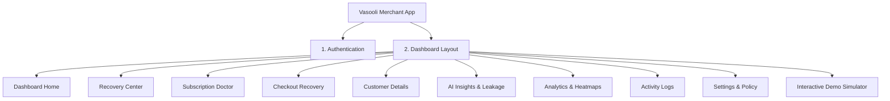

# Phase 1 – Frontend Development Plan: Merchant Command Dashboard

> **IMPORTANT: Read this entire document before writing a single line of code.**  
> This project follows a production-first approach. Do not start implementing components immediately. First understand the complete project architecture, business flow, user journey, design system, and data requirements. Every screen must be built with future backend integration in mind. Avoid hardcoded inline values; use structured mock schemas.

---

## 1. Executive Summary & Objective

**Vasooli** is an AI-powered autonomous revenue recovery agent that helps merchants recover failed subscription payments and abandoned checkouts while strictly following NPCI's UPI AutoPay retry regulations (max 3-4 attempts, 24h cooldown, pre-debit rules, hard stop states).

**Phase 1 Goal**: Build a clean, enterprise-grade, modern FinTech SaaS dashboard where merchants can:
1. Monitor failed payments & recurring subscription renewals in real time.
2. Track UPI AutoPay recovery attempts against regulatory limits (1/4 attempt counter, cooldown status).
3. View explainable AI-generated recovery insights & natural language recommendations.
4. Manage margin-aware checkout recovery campaigns (5% -> 10% dynamic discount ceiling).
5. Analyze money leakage, recovery ROI, and customer churn risk.
6. Deliver an authentic, production-quality user experience that looks and feels like an internal **Razorpay / Stripe** core product.

---

## 2. UI / UX Design Guidelines (Strict Standards)

> [!IMPORTANT]
> **FinTech Enterprise Standard — NOT a Hackathon / Gaming Dashboard**  
> The UI must look like a real FinTech SaaS product that could be shipped by Razorpay or Stripe. Every screen should prioritize readability, calm data density, and clear visual hierarchy over flashy decoration.

### Design Principles
- **Clean & Minimal**: Generous whitespace, well-proportioned layout, zero clutter.
- **Calm & Professional**: Subtle contrast, clear typographic hierarchy, purposeful color accents.
- **Enterprise & Data-Focused**: High-density data tables, intuitive filter bars, interactive drill-down drawers, clear status badges.
- **Fast Scanning**: Merchants can understand their money leakage and recovery performance within 3 seconds.

### Visual Style

| Attribute | Preferred Standard | Strictly Forbidden (Do NOT Use) |
| :--- | :--- | :--- |
| **Theme & Background** | Neutral Zinc/Slate (`#09090B` background, `#18181B` cards, `#27272A` borders) | Neon colors, Cyberpunk themes, RGB glow borders |
| **Cards & Borders** | Flat/subtle elevation, 8px–12px radius, 1px subtle neutral border (`border-zinc-800`) | Heavy glassmorphism everywhere, glowing outlines |
| **Colors** | Indigo/Blue accent (`#6366F1`), Green success (`#22C55E`), Amber warning (`#F59E0B`), Red danger (`#EF4444`) | Matrix green terminals, loud oversaturated rainbow palettes |
| **Typography** | Clean Inter / Geist / Plus Jakarta Sans with clear font weights (400, 500, 600, 700) | Novelty/display fonts, unreadable low-contrast text |
| **Icons** | Clean, minimalist **Lucide Icons** only | 3D icons, cartoon stickers, emojis, neon icon packs |
| **Animations** | Subtle Framer Motion (fade-in, 150ms hover elevation, smooth sheet/drawer slide) | Infinite loops, bounces, spinning cards, flashing glows |
| **Charts** | Minimalist **Recharts** with clean gridlines, calm color fills, and custom tooltips | Cluttered 3D charts, jarring rainbow color schemes |

### Color Palette Specification

```css
/* Core Color Tokens */
--bg-primary: #09090B;        /* Deep Neutral Zinc */
--bg-card: #18181B;           /* Solid Elevated Card */
--bg-card-hover: #27272A;     /* Interactive Hover State */
--border-subtle: #27272A;     /* 1px Clean Border */
--border-focus: #3F3F46;      /* Active Element Border */

--text-primary: #FAFAFA;      /* High-contrast crisp text */
--text-secondary: #A1A1AA;    /* Muted secondary labels */
--text-tertiary: #71717A;     /* Micro-text and timestamps */

--accent-primary: #6366F1;    /* FinTech Indigo */
--accent-primary-hover: #4F46E5;
--status-success: #22C55E;    /* Emerald Green (Recovered / Compliant) */
--status-warning: #F59E0B;    /* Amber (Cooldown / Retry Scheduled) */
--status-danger: #EF4444;     /* Crimson (Payment Failed / Stop Reached) */
--status-info: #3B82F6;       /* Clean Blue (AI Analyzing / Active Link) */
```

---

## 3. Detailed Page Breakdown & Features



### Page 1: Authentication (`/login`, `/signup`, `/forgot-password`)
- **Login**: Email, Password, Remember Me, Forgot Password link, Login Button with loading spinner, Demo 1-Click Credentials fill.
- **Signup**: Business Name, Merchant Legal Name, Work Email, Password, Confirm Password, Razorpay Mode selector (Test/Live).
- **Validation**: React Hook Form + Zod schema validation with clear inline error messages.
- **Protected Route Middleware**: Redirects unauthenticated sessions; preserves redirect URL.

### Page 2: Executive Dashboard (`/dashboard`)
- **Top Metrics Row (8 Metric Cards)**:
  1. `Total Revenue`: Gross subscription & checkout throughput (₹)
  2. `Recovered Revenue`: Total revenue rescued by Vasooli AI (₹)
  3. `Money Leakage Today`: Amount at risk from current day failures (₹)
  4. `Recovery Success Rate`: High-visibility percentage badge (e.g. 68.4%)
  5. `Failed Payments`: Count & amount of failed transactions
  6. `Failed Subscription Renewals`: AutoPay / e-Mandate failures count
  7. `Recovered Customers`: Unique customers retained
  8. `AI Health & Compliance Score`: 100% NPCI Regulatory Adherence meter
- **Interactive Visual Charts**:
  - `Revenue vs Recovery Trend`: Dual-area chart comparing gross revenue vs recovered revenue over 30 days.
  - `Failure Breakdown by Bank Reason`: Donut chart (`U30 Insufficient Balance`, `UT Timeout`, `ZM MPIN`, `U54 Limit Exceeded`).
  - `Recovery Channel Efficiency`: Bar chart (AutoPay Scheduled Retries vs Smart Payment Links vs Dynamic Checkout Offers).
- **Recent Activity Live Feed**:
  - Real-time updates of payment failures, AI decisions, WhatsApp notifications, and successful recoveries.

### Page 3: Recovery Center (`/recoveries`)
- **Data Table**:
  - Columns: `Customer (Avatar + Name + Email)`, `Amount (₹)`, `Payment Type (Subscription / Checkout)`, `Failure Code & Reason Badge`, `Retry Attempt (e.g. 2/4)`, `Next Retry Window (Time + Cooldown)`, `AI Recovery Score (0-100% Progress bar)`, `Status Badge`, `Action Menu`.
- **Status Badges**:
  - `ANALYZING_AI` (Blue)
  - `SCHEDULED_RETRY` (Amber)
  - `PAYMENT_LINK_SENT` (Indigo)
  - `RECOVERED` (Emerald)
  - `STOP_NPCI_LIMIT_REACHED` (Zinc/Red)
  - `STOP_TERMINAL_FAILURE` (Red)
  - `STOP_OPTED_OUT` (Gray)
- **Filters & Search**:
  - Global search by customer name, email, payment ID.
  - Filter by Status, Failure Code, Date Range, Channel.
  - Sorting on Amount, Recovery Score, and Retry Date.
  - Pagination (10, 25, 50 rows per page).
- **Explainable AI Detail Drawer (Slide-out Sheet)**:
  - Customer Profile summary & lifetime recovery stats.
  - 4-Step NPCI Attempt Progress Tracker (Attempt 1 -> Attempt 2 -> Attempt 3 -> Stop State).
  - AI Decision Rationale card explaining *why* the action was chosen and *why* it is regulatory compliant.
  - Complete Communication Timeline (WhatsApp sent, Payment link clicked, Retry executed).
  - Quick Actions: `Trigger Immediate Manual Retry (Admin)`, `Send Instant Payment Link`, `Pause Recovery`, `Close Recovery`.

### Page 4: Subscription Doctor (`/subscriptions`)
- **Focus**: UPI AutoPay, e-Mandates, Card Renewals health.
- **Top KPI Cards**: `Renewals Today`, `Failed Renewals`, `Recovered Renewals`, `Pending In Queue`, `Churned / Cancelled`.
- **Subscription Health Table**:
  - Plan name, recurring cycle (monthly/annual), customer VPA/Bank, mandate max limit, current attempt status.
- **Retry Schedule Timeline View**:
  - Interactive calendar/queue visual showing upcoming scheduled AutoPay presentations (09:15 AM banking hour batch).

### Page 5: Checkout Recovery (`/checkout`)
- **Focus**: Abandoned cart & checkout drop-off recovery.
- **Top KPI Cards**: `Abandoned Carts`, `Recovered Orders`, `Cart Conversion %`, `Margin Protected Revenue`.
- **Campaign Funnel Visual**:
  - Stage 1: T+15m Inactivity Cart Nudge (0% discount)
  - Stage 2: T+3h Dynamic Incentive (5% discount)
  - Stage 3: T+24h Final Floor Offer (10% max merchant discount)
  - Stage 4: T+48h Hard Stop (No spam guarantee)
- **Table**: Customer, Items Summary, Cart Value, Coupon Applied, Reminder Delivery Status, Payment Link Status, Recovery Stage.

### Page 6: Customer 360° Profile (`/customers/:id` or Drawer)
- Customer Profile Card (Name, Email, Phone, Verified UPI VPA, Member Since).
- AI Risk Score & Recovery Probability Meter.
- Payment History Ledger & Lifetime Recovered Value (₹).
- Subscription Mandate History & Status.
- Communication Log (WhatsApp delivery receipts, Email opens, Link clicks).

### Page 7: AI Insights & Money Leakage Center (`/insights`)
- **Natural Language Insight Banners**:
  - *"14 subscription renewals are predicted to fail tomorrow due to mid-month liquidity constraints."*
  - *"₹28,400 can still be legally recovered within active NPCI retry windows."*
  - *"HDFC & ICICI AutoPay debits show +28% higher success between 09:15 AM - 10:30 AM."*
- **Recommendation Cards with Severity & 1-Click Action**:
  - High Impact: Enable 24h WhatsApp pre-debit advisory.
  - Medium Impact: Adjust checkout stage-2 discount from 5% to 7% for high-LTV drop-offs.
- **Daily Money Leakage Breakdown Report**:
  - Today's Lost Revenue vs Recovered vs Prevented Penalties.

### Page 8: Analytics & Heatmaps (`/analytics`)
- Recovery Success Rate over time.
- Average Retries to Success (e.g. 1.4 attempts).
- Payment Failure Reason Heatmap (Hour of day vs Bank Failure code).
- Channel Recovery Distribution (WhatsApp vs Email vs SMS vs Direct Debit).
- Merchant Revenue Saved ROI Multiplier.

### Page 9: Activity Logs (`/activity`)
- Chronological, audit-grade activity stream:
  - `PAYMENT_FAILED` -> `NPCI_VALIDATED` -> `AI_DECISION_RECORDED` -> `WHATSAPP_DISPATCHED` -> `LINK_GENERATED` -> `PAYMENT_CAPTURED` -> `RECOVERY_CLOSED`.
- Filterable by Entity, Status, and Compliance Tag.

### Page 10: Settings & Business Rules (`/settings`)
- **Merchant Details**: Business Name, Brand Logo, Support Email, Currency (INR ₹).
- **Razorpay API Keys**: Key ID, Key Secret (masked), Webhook Secret, Webhook URL endpoint.
- **Compliance & Recovery Rules**:
  - Max AutoPay Retries (Strict cap: 3 or 4).
  - Minimum Cooldown Hours (Enforced: 24h).
  - Banking Window Preference (Default: 09:15 AM - 11:30 AM).
- **Dynamic Discount Limits**:
  - Max Allowed Discount Floor (e.g., 10%).
  - Allow Dynamic Checkout Incentives (Toggle).
- **Notification Preferences**: WhatsApp / Email / SMS toggles.

### Page 11: Interactive Hackathon Event Simulator (`/simulator` / Topbar Quick-Access)
- **One-Click Event Triggers for Live Demos**:
  1. `Simulate UPI AutoPay Low Balance (U30)` -> AI calculates salary date & schedules 24h retry.
  2. `Simulate NPCI Limit Breach (Attempt 3 Fail)` -> AI triggers `STOP_STATE: NPCI_LIMIT_REACHED` and sends Payment Link.
  3. `Simulate Terminal Bank Code (ZG VPA Inactive)` -> AI immediately halts recovery.
  4. `Simulate Checkout Abandonment` -> Triggers progressive 5% -> 10% dynamic recovery flow.
  5. `Simulate Customer Completing Payment` -> Instant real-time dashboard recovery update.

---

## 4. Frontend Project Structure

```
client/ (or frontend/)
├── public/
│   ├── favicon.ico
│   └── logo.svg
├── src/
│   ├── app/
│   │   ├── (auth)/
│   │   │   ├── login/page.tsx
│   │   │   ├── signup/page.tsx
│   │   │   └── forgot-password/page.tsx
│   │   ├── (dashboard)/
│   │   │   ├── layout.tsx                     # Sidebar + Top Navbar shell
│   │   │   ├── page.tsx                       # Redirects to /dashboard
│   │   │   ├── dashboard/page.tsx             # Executive Overview
│   │   │   ├── recoveries/page.tsx            # Recovery Center & Drawer
│   │   │   ├── subscriptions/page.tsx         # Subscription Doctor
│   │   │   ├── checkout/page.tsx              # Checkout Recovery Funnel
│   │   │   ├── customers/
│   │   │   │   ├── page.tsx                   # Customer List
│   │   │   │   └── [id]/page.tsx              # Customer 360 Profile
│   │   │   ├── insights/page.tsx              # AI Insights & Money Leakage
│   │   │   ├── analytics/page.tsx             # Analytics & Heatmaps
│   │   │   ├── activity/page.tsx              # Audit Activity Logs
│   │   │   ├── settings/page.tsx              # Business Rules & Razorpay Config
│   │   │   └── simulator/page.tsx             # Live Hackathon Demo Simulator
│   │   ├── globals.css                        # Design system & dark theme tokens
│   │   └── layout.tsx                         # Root layout (Inter font, Providers)
│   │
│   ├── components/
│   │   ├── layout/
│   │   │   ├── Sidebar.tsx                    # Collapsible FinTech navigation
│   │   │   ├── Topbar.tsx                     # Search, Notifications, Merchant profile
│   │   │   └── PageHeader.tsx                 # Breadcrumbs + Title + Action buttons
│   │   ├── dashboard/
│   │   │   ├── MetricCard.tsx                 # Metric card with trend indicator
│   │   │   ├── RevenueRecoveryChart.tsx       # Recharts area chart
│   │   │   ├── FailureBreakdownChart.tsx      # Donut reason chart
│   │   │   ├── RecoveryFunnelChart.tsx        # Stage conversion bars
│   │   │   ├── RecentActivityFeed.tsx         # Live activity stream
│   │   │   └── MoneyLeakageBanner.tsx         # Today's leakage & recovery rate
│   │   ├── recovery/
│   │   │   ├── RecoveryDataTable.tsx          # Sortable, filterable, paginated table
│   │   │   ├── RecoveryDetailDrawer.tsx       # Slide-over with AI explainability & timeline
│   │   │   ├── NpciAttemptProgress.tsx        # Visual 1/4 attempt stepper with cooldown badge
│   │   │   ├── AiExplainabilityCard.tsx       # Plain-English AI rationale & confidence meter
│   │   │   └── RecoveryStatusBadge.tsx        # Standardized status badge
│   │   ├── subscription/
│   │   │   ├── SubscriptionTable.tsx          # Recurring mandates & renewal dates
│   │   │   └── RetryCalendarQueue.tsx         # Next retry queue schedule
│   │   ├── checkout/
│   │   │   ├── AbandonedCartTable.tsx         # Cart values, drop-off times, discount applied
│   │   │   └── DynamicOfferSimulator.tsx      # Margin-floor visual slider
│   │   ├── customer/
│   │   │   ├── CustomerProfileHeader.tsx      # Risk score, LTV, contact
│   │   │   └── CustomerTimeline.tsx           # Multi-event history stream
│   │   ├── insights/
│   │   │   ├── NaturalLanguageInsightCard.tsx # Plain-text actionable alert
│   │   │   └── MoneyLeakageReportCard.tsx     # Breakdown of lost vs recovered funds
│   │   ├── analytics/
│   │   │   ├── FailureHeatmap.tsx             # Bank codes vs hour of day
│   │   │   └── ChannelEfficiencyChart.tsx     # AutoPay vs Link vs WhatsApp
│   │   ├── simulator/
│   │   │   └── SimulatorControlPanel.tsx      # 1-click test event trigger buttons
│   │   └── ui/                                # Clean shadcn-style primitives
│   │       ├── Button.tsx
│   │       ├── Card.tsx
│   │       ├── Badge.tsx
│   │       ├── Input.tsx
│   │       ├── Select.tsx
│   │       ├── Table.tsx
│   │       ├── Dialog.tsx
│   │       ├── Sheet.tsx                      # Drawer primitive
│   │       ├── Tabs.tsx
│   │       ├── Progress.tsx
│   │       ├── Tooltip.tsx
│   │       ├── Skeleton.tsx
│   │       └── Toast.tsx
│   │
│   ├── hooks/
│   │   ├── useRecoveries.ts                   # Fetch & filter recoveries
│   │   ├── useAnalytics.ts                    # KPI metrics & charts data
│   │   ├── useSubscriptions.ts                # Recurring mandates
│   │   ├── useCheckoutRecovery.ts             # Cart abandonments
│   │   ├── useAiInsights.ts                   # AI natural language suggestions
│   │   └── useSimulator.ts                    # Trigger demo events & update state
│   │
│   ├── context/
│   │   ├── AuthContext.tsx                    # Merchant login & session state
│   │   └── SimulatorContext.tsx               # Reactive state for live demo events
│   │
│   ├── services/
│   │   ├── api.ts                             # Axios client instance with interceptors
│   │   ├── recoveryService.ts                 # Recovery endpoints
│   │   ├── analyticsService.ts                # Metrics endpoints
│   │   └── simulatorService.ts                # Mock / live event dispatcher
│   │
│   ├── data/                                  # Structured mock JSON datasets
│   │   ├── mockRevenue.ts                     # Revenue & leakage timeseries
│   │   ├── mockRecoveries.ts                  # Comprehensive recovery records
│   │   ├── mockSubscriptions.ts               # AutoPay plans & mandate statuses
│   │   ├── mockAbandonedCarts.ts              # Drop-offs & discount stages
│   │   ├── mockCustomers.ts                   # Customer profiles & LTV
│   │   ├── mockAiInsights.ts                  # Actionable AI cards
│   │   └── mockActivityLogs.ts                # Audit trail events
│   │
│   ├── types/
│   │   ├── recovery.ts                        # Enums, statuses, recovery interfaces
│   │   ├── subscription.ts                    # Mandate & plan types
│   │   ├── customer.ts                        # Customer profile types
│   │   ├── analytics.ts                       # Chart & metric types
│   │   └── ai.ts                              # AI decision & explainability types
│   │
│   ├── utils/
│   │   ├── currency.ts                        # Indian Rupee (₹) formatter with lakhs/crores
│   │   ├── date.ts                            # Date formatting & relative time (e.g. "2h ago")
│   │   ├── npci.ts                            # NPCI error code descriptions & rule helpers
│   │   └── cn.ts                              # Tailwind class merging utility
│   │
│   └── constants/
│       ├── npciRules.ts                       # Attempt limits, error code labels
│       └── navigation.ts                      # Sidebar items & breadcrumb definitions
```

---

## 5. Structured Mock Datasets Design

To ensure the frontend is 100% testable, interactive, and demo-ready before backend integration:
- `mockRevenue.ts`: Daily revenue, recovered revenue, leakage amounts, and recovery rate over 30 days.
- `mockRecoveries.ts`: 25+ realistic recovery records across all failure codes (`U30`, `ZM`, `UT`, `U54`, `ZG`, `U16`), attempt counts (1/4 to 4/4), and statuses (`SCHEDULED_RETRY`, `PAYMENT_LINK_SENT`, `RECOVERED`, `STOP_NPCI_LIMIT_REACHED`, `STOP_TERMINAL_FAILURE`).
- `mockSubscriptions.ts`: Active SaaS & OTT subscription plans (Pro Annual ₹2,499, Enterprise Monthly ₹9,999, Starter ₹499) with UPI AutoPay mandates.
- `mockAbandonedCarts.ts`: E-commerce drop-offs with cart values, stage 1-3 nudges, and margin-protected discounts.
- `mockCustomers.ts`: Customer profiles with payment histories, risk scores, and lifetime recovery numbers.
- `mockAiInsights.ts`: High-priority natural language recommendations and leakage reports.
- `mockActivityLogs.ts`: Chronological event audit log with NPCI compliance tags.

---

## 6. Execution Steps for Phase 1

1. **Step 1: Setup Dependencies & Design Tokens**
   - Configure TailwindCSS with custom neutral zinc/slate palette, Lucide icons, Inter typography, and glassmorphism/card styles.
   - Build UI primitives (`Button`, `Card`, `Badge`, `Input`, `Table`, `Sheet/Drawer`, `Dialog`, `Progress`, `Skeleton`, `Toast`).
2. **Step 2: Core Layout & Navigation**
   - Build responsive `Sidebar` (collapsible, active states, badge indicators).
   - Build `Topbar` with global search, live status badge, notifications drawer, and quick demo simulator trigger.
   - Build `PageHeader` with breadcrumbs and action buttons.
3. **Step 3: Build Authentication Flow**
   - Create `/login`, `/signup`, `/forgot-password` with Zod validation and 1-click Demo Merchant login.
4. **Step 4: Build Executive Dashboard (`/dashboard`)**
   - Build 8 metric cards, Revenue vs Recovery area chart, Failure donut chart, and Recent Activity feed.
5. **Step 5: Build Recovery Center & Explainable AI Drawer (`/recoveries`)**
   - Build sortable, filterable data table with status badges and search.
   - Build slide-out detail drawer with NPCI 4-attempt progress bar, AI Decision rationale card, and full communication timeline.
6. **Step 6: Build Subscription Doctor (`/subscriptions`)**
   - Build recurring renewal cards, UPI AutoPay mandate table, and upcoming 09:15 AM retry queue schedule.
7. **Step 7: Build Checkout Recovery (`/checkout`)**
   - Build abandoned cart funnel, dynamic 5%/10% discount stages, and margin floor protection visualizer.
8. **Step 8: Build AI Insights & Money Leakage Center (`/insights`)**
   - Build natural language insight cards and daily leakage breakdown.
9. **Step 9: Build Customer 360° Profile & Activity Logs (`/customers`, `/activity`)**
   - Customer profile with payment history, risk score, and audit-grade activity stream.
10. **Step 10: Build Settings & Policy Controls (`/settings`)**
    - Razorpay keys setup, NPCI retry cap sliders, dynamic discount floor limits.
11. **Step 11: Build Interactive Demo Simulator & Verification**
    - One-click trigger panel for hackathon judges to simulate `U30` retry scheduling, `Attempt 3` Stop State, `ZG` Terminal Stop, and instant payment recovery.
    - Validate responsiveness, dark mode consistency, and TypeScript compilation with zero errors.

---

## 7. Deliverables & Verification Checklist for Phase 1

- [ ] All 10+ pages built and functional with clean, responsive navigation.
- [ ] Strictly follows FinTech design guidelines (Calm, Minimal, Slate/Zinc neutral palette, Lucide icons, no neon/cyberpunk).
- [ ] Live Recharts visualizations (Area, Donut, Bar, Funnel) with custom tooltips.
- [ ] Explainable AI Drawer with NPCI attempt counter and plain-English decision reasoning.
- [ ] Interactive Hackathon Simulator to trigger live event state transitions.
- [ ] Complete TypeScript type safety across all components, props, and mock data.
- [ ] Zero build or lint errors.
- [ ] **STOP after Phase 1 completion** for user review and approval before starting Phase 2 backend development.
